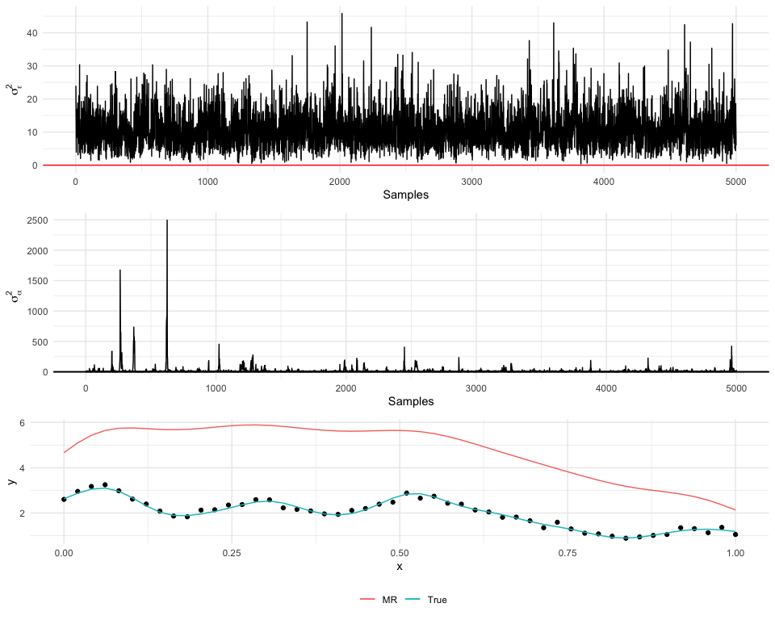

## Code to implement models from Higdon D. (2002) Space and Space-Time Modeling using Process Convolutions.

## Basic Model

## Multiresolution Model

## Multiresolution MCMC Code

    ## ── Attaching packages ─────────────────────────────────────── tidyverse 1.3.1 ──

    ## ✓ tibble  3.1.2     ✓ dplyr   1.0.6
    ## ✓ tidyr   1.1.3     ✓ stringr 1.4.0
    ## ✓ readr   1.4.0     ✓ forcats 0.5.1
    ## ✓ purrr   0.3.4

    ## ── Conflicts ────────────────────────────────────────── tidyverse_conflicts() ──
    ## x dplyr::combine() masks gridExtra::combine()
    ## x dplyr::filter()  masks stats::filter()
    ## x dplyr::lag()     masks stats::lag()

    ##   [1] "mcmc_mr <- function(y, x, "                                                           
    ##   [2] "                    knots, radius = rad, form = \"gaussian\", "                       
    ##   [3] "                    n_mcmc = 5000, burnin = 2500, n_message = 500) {"                 
    ##   [4] "    "                                                                                 
    ##   [5] "    N <- length(y)"                                                                   
    ##   [6] "    m1 <- length(knots$knots1)"                                                       
    ##   [7] "    m2 <- length(knots$knots2)"                                                       
    ##   [8] "    m3 <- length(knots$knots3)"                                                       
    ##   [9] "    m <- m1 + m2 + m3"                                                                
    ##  [10] "    "                                                                                 
    ##  [11] "    ## get prior parameters"                                                          
    ##  [12] "    a_epsilon0 <- 0.01"                                                               
    ##  [13] "    b_epsilon0 <- 0.01"                                                               
    ##  [14] "    a_alpha0 <- 0.01"                                                                 
    ##  [15] "    b_alpha0 <- 0.01"                                                                 
    ##  [16] "    "                                                                                 
    ##  [17] "    ## initialize parameters"                                                         
    ##  [18] "    sigma2_epsilon1 <- runif(1, 1, 5)"                                                
    ##  [19] "    "                                                                                 
    ##  [20] "    sigma2_alpha1 <- runif(1, 1, 5)"                                                  
    ##  [21] "    sigma2_alpha2 <- runif(1, 1, 5)"                                                  
    ##  [22] "    sigma2_alpha3 <- runif(1, 1, 5)"                                                  
    ##  [23] "    "                                                                                 
    ##  [24] "    alpha1 <- rnorm(m1, 0, 1)"                                                        
    ##  [25] "    alpha2 <- rnorm(m2, 0, 1)"                                                        
    ##  [26] "    alpha3 <- rnorm(m3, 0, 1)"                                                        
    ##  [27] "    "                                                                                 
    ##  [28] "    Z1 <- make_basis(x, knots$knots1, radius[1], form = form)"                        
    ##  [29] "    Z2 <- make_basis(x, knots$knots2, radius[2], form = form)"                        
    ##  [30] "    Z3 <- make_basis(x, knots$knots3, radius[3], form = form)"                        
    ##  [31] "    "                                                                                 
    ##  [32] "    ## precalculate values"                                                           
    ##  [33] "    tZZ1 <- t(Z1) %*% Z1"                                                             
    ##  [34] "    tZZ2 <- t(Z2) %*% Z2"                                                             
    ##  [35] "    tZZ3 <- t(Z3) %*% Z3"                                                             
    ##  [36] "    "                                                                                 
    ##  [37] "    tZ1y <- t(Z1) %*% y"                                                              
    ##  [38] "    tZ2y <- t(Z2) %*% y"                                                              
    ##  [39] "    tZ3y <- t(Z3) %*% y"                                                              
    ##  [40] "    "                                                                                 
    ##  [41] "    I_m1 <- diag(m1)"                                                                 
    ##  [42] "    I_m2 <- diag(m2)"                                                                 
    ##  [43] "    I_m3 <- diag(m3)"                                                                 
    ##  [44] "    "                                                                                 
    ##  [45] "    ## set up save variables"                                                         
    ##  [46] "    sigma2_epsilon_save <- rep(0, n_mcmc-burnin)"                                     
    ##  [47] "    "                                                                                 
    ##  [48] "    sigma2_alpha1_save <- rep(0, n_mcmc-burnin)"                                      
    ##  [49] "    sigma2_alpha2_save <- rep(0, n_mcmc-burnin)"                                      
    ##  [50] "    sigma2_alpha3_save <- rep(0, n_mcmc-burnin)"                                      
    ##  [51] "    "                                                                                 
    ##  [52] "    alpha1_save <- matrix(0, n_mcmc-burnin, m1)"                                      
    ##  [53] "    alpha2_save <- matrix(0, n_mcmc-burnin, m2)"                                      
    ##  [54] "    alpha3_save <- matrix(0, n_mcmc-burnin, m3)"                                      
    ##  [55] "    "                                                                                 
    ##  [56] "    ## mcmc loop"                                                                     
    ##  [57] "    for(k in 1:n_mcmc) {"                                                             
    ##  [58] "        # if (k%% n_message == 0) {"                                                  
    ##  [59] "        #     message(\"Iteration \", k , \" out of \", n_mcmc)"                      
    ##  [60] "        # }"                                                                          
    ##  [61] "        "                                                                             
    ##  [62] "        ## sample sigma2 alpha 1"                                                     
    ##  [63] "        sigma2_alpha1 <- 1 / rgamma(1, a_alpha0 + m1/2,"                              
    ##  [64] "                                    b_alpha0 + (t(alpha1) %*% alpha1) / 2)"           
    ##  [65] ""                                                                                     
    ##  [66] "        ## sample sigma2 alpha 2"                                                     
    ##  [67] "        sigma2_alpha2 <- 1 / rgamma(1, a_alpha0 + m2/2,"                              
    ##  [68] "                                    b_alpha0 + (t(alpha2) %*% alpha2) / 2)"           
    ##  [69] ""                                                                                     
    ##  [70] "        ## sample sigma2 alpha 3"                                                     
    ##  [71] "        sigma2_alpha3 <- 1 / rgamma(1, a_alpha0 + m3/2,"                              
    ##  [72] "                                    b_alpha0 + (t(alpha3) %*% alpha3) / 2)"           
    ##  [73] "        "                                                                             
    ##  [74] "        ## sample sigma2 epsilon"                                                     
    ##  [75] "        Zalpha <- Z1 %*% alpha1 + Z2 %*% alpha2 + Z3 %*% alpha3"                      
    ##  [76] "        sigma2_epsilon <- 1 / rgamma(1, a_epsilon0 + N/2,"                            
    ##  [77] "                                     b_epsilon0 + (t(y - Zalpha) %*% (y - Zalpha))/2)"
    ##  [78] "        "                                                                             
    ##  [79] "        "                                                                             
    ##  [80] "        ## sample alpha1"                                                             
    ##  [81] "        A_inv1 <- solve(tZZ1 / sigma2_epsilon + (1/sigma2_alpha1)*I_m1)"              
    ##  [82] "        b1 <- tZ1y  / sigma2_epsilon"                                                 
    ##  [83] "        alpha1 <- c(mvnfast::rmvn(1, A_inv1 %*% b1, A_inv1))"                         
    ##  [84] "        "                                                                             
    ##  [85] "        ## sample alpha2"                                                             
    ##  [86] "        A_inv2 <- solve(tZZ2 / sigma2_epsilon + (1/sigma2_alpha2)*I_m2)"              
    ##  [87] "        b2 <- tZ2y  / sigma2_epsilon"                                                 
    ##  [88] "        alpha2 <- c(mvnfast::rmvn(1, A_inv2 %*% b2, A_inv2))"                         
    ##  [89] "        "                                                                             
    ##  [90] "        ## sample alpha3"                                                             
    ##  [91] "        A_inv3 <- solve(tZZ3 / sigma2_epsilon + (1/sigma2_alpha3)*I_m3)"              
    ##  [92] "        b3 <- tZ3y  / sigma2_epsilon"                                                 
    ##  [93] "        alpha3 <- c(mvnfast::rmvn(1, A_inv3 %*% b3, A_inv3))"                         
    ##  [94] "        "                                                                             
    ##  [95] "        ## save MCMC variables"                                                       
    ##  [96] "        if(k > burnin) {"                                                             
    ##  [97] "            i <- k-burnin"                                                            
    ##  [98] "            sigma2_epsilon_save[i] <- sigma2_epsilon"                                 
    ##  [99] "            sigma2_alpha1_save[i] <- sigma2_alpha1"                                   
    ## [100] "            sigma2_alpha2_save[i] <- sigma2_alpha2"                                   
    ## [101] "            sigma2_alpha3_save[i] <- sigma2_alpha3"                                   
    ## [102] "            alpha1_save[i, ] <- alpha1"                                               
    ## [103] "            alpha2_save[i, ] <- alpha2"                                               
    ## [104] "            alpha3_save[i, ] <- alpha3"                                               
    ## [105] "        }"                                                                            
    ## [106] "    }"                                                                                
    ## [107] "    "                                                                                 
    ## [108] "    return(list(sigma2_epsilon = sigma2_epsilon_save,"                                
    ## [109] "                sigma2_alpha1 = sigma2_alpha1_save,"                                  
    ## [110] "                sigma2_alpha2 = sigma2_alpha2_save,"                                  
    ## [111] "                sigma2_alpha3 = sigma2_alpha3_save,"                                  
    ## [112] "                alpha1 = alpha1_save,"                                                
    ## [113] "                alpha2 = alpha2_save,"                                                
    ## [114] "                alpha3 = alpha3_save))"                                               
    ## [115] "}"
